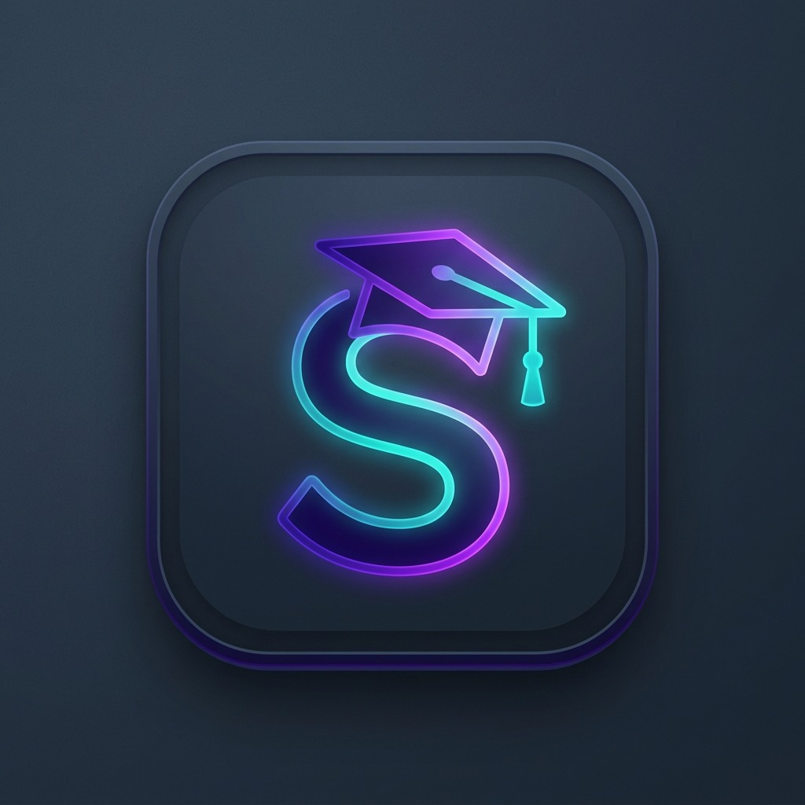

# StudentFocus — AI Study Planner & Student Productivity App

  

  <strong>An AI-powered on-device student productivity and study management application for Android</strong>

  
  
  
  

---

## 📌 Project Overview & Identity

- **Application Name:** StudentFocus
- **Official Website:** [https://studentfocus-apk.vercel.app/](https://studentfocus-apk.vercel.app/)
- **GitHub Repository:** [https://github.com/nishantkumar-AIML/StudentFocus](https://github.com/nishantkumar-AIML/StudentFocus)
- **Target Platform:** Android 8.0+ (Oreo) or later
- **Current Version:** 5.0 (Standalone `.apk`)
- **Cost / Model:** 100% Free, zero subscriptions, zero ads, zero cloud telemetry

**StudentFocus** is an AI-powered student productivity and study management Android application designed for disciplined school, college, and university students. It unifies core academic tools—study planning, class timetables, attendance monitoring, exam preparation, focus timers, GPA/CGPA calculators, revision flashcards, and private StudentOS AI—into a distraction-free, 100% offline environment.

---

## 🎯 The Student Problem StudentFocus Solves

Modern students are overwhelmed by fragmented apps:
1. **Ad-ridden & Subscription Paywalls:** Most study apps charge monthly subscriptions for basic features or interrupt deep study sessions with invasive video ads.
2. **Cloud Tracking & Privacy Risks:** Commercial tools harvest study habits, personal schedules, and notes onto remote servers.
3. **Fragmented Workflows:** Students have to juggle separate apps for timetables, attendance, timers, task boards, and GPA math.
4. **Unrealistic Scheduling:** Generic planners fail to budget for daily life, leading to missed targets and exam stress.

**StudentFocus solves this** by providing a comprehensive, single-app academic operating system with **100% on-device data sovereignty**. All data is stored locally in your phone's SQLite database.

---

## 🚀 Key Features

### 1. Scholar Dashboard & Study Analytics
- **Dynamic Study Pace & Feasibility:** Calculates exact daily study duration required to meet long-term targets against your available 24-hour routine budget.
- **Continuous 24h Study Heatmap:** Hour-by-hour activity density visualization for honest self-reflection.
- **Time Waste & Idle Tracker:** Real-time auditor tracking phone procrastination until you begin a designated study task.
- **Focus Study Stopwatch:** High-precision count-up timer with ambient sound frequency sliders (white noise, rain, focus frequencies) and persistent Android notification shade status.

### 2. Assignment Management & Study Notes
- **Kanban Study Board:** 4-stage academic workflow (*Uncomplete*, *To Do*, *In Progress*, *Done*) with instant calendar date-picker filtering.
- **Markdown Notes:** Distraction-free note-taking space with real-time word count and local persistence.

### 3. Academic Module Suite (10 Dedicated Tools)
1. **Weekly Class Timetable:** Day-by-day lecture and lab scheduler (Monday–Saturday) with routine alarm integrations.
2. **Attendance Percentage Tracker:** Subject-wise presence and absence tracker with 75% and 80% threshold alerts to prevent exam debarment.
3. **Subject GPA Calculator:** Official 10-point scale credit-weighted formula (`GPA = Σ(Credits × Grade Points) / Total Credits`) handling Reappear (RA) and course credits.
4. **Semester CGPA Calculator:** Multi-semester cumulative degree CGPA aggregator.
5. **Revision Flashcards:** Spaced active recall study decks stored 100% offline.
6. **21-Day Habit Challenge:** Habit streaks for consistent study routines.
7. **Student Cash Ledger:** Local financial tracker with CSV import/export and PDF export.
8. **24-Hour Routine Audit:** Daily routine auditor with student timetable templates (Useful, Necessary, Waste, Free).
9. **Activity Intelligence:** On-device topic classifier categorizing activity into Aligned, Relevant, and Off-Goal buckets without sending data off-device.
10. **Arrange Academic Sections:** Reorderable tab customization.

### 4. Dual-Mode StudentOS AI
- **Offline Mode (Default):** Runs 100% locally on-device with zero network access. Executes `@help`, `@task`, `@routine`, `@attendance`, `@cgpa`, and `@date`.
- **Online Mode (Optional):** Used strictly for interactive academic tutoring over HTTPS; personal schedules, timetables, and notes are never uploaded.

---

## 🛠️ Architecture & Technology

- **Operating System:** Android 8.0+ (Oreo, API level 26+)
- **Database:** Local SQLite / Android Room architecture
- **Networking:** Offline-first; zero network required for core functionality
- **Web App / Landing:** Pure semantic HTML5, CSS3, ES6+ JavaScript, hosted on Vercel with automated build pipeline (`build.js`)

---

## 📥 Installation Guide

1. Download the latest official APK: [**Download 5.apk**](https://github.com/nishantkumar-AIML/StudentFocus/releases/download/StudentFocus/5.apk).
2. Open the downloaded `.apk` file from your device's **Files** or **Downloads** folder.
3. If prompted by Android, allow installation from unknown sources for your browser or file manager.
4. Tap **Install**.

### Handling Google Play Protect
Official Guide: [https://studentfocus-apk.vercel.app/#installation](https://studentfocus-apk.vercel.app/#installation)

If Android blocks the StudentFocus APK, follow these steps:
1. Download the APK only from the official StudentFocus release: [5.apk](https://github.com/nishantkumar-AIML/StudentFocus/releases/download/StudentFocus/5.apk).
2. Open the **Google Play Store**.
3. Tap your **profile icon** in the top-right corner.
4. Select **Play Protect**.
5. Tap the **Settings** icon.
6. If Play Protect is blocking a verified APK, carefully review the warning before proceeding.
7. Keep **Play Protect enabled whenever possible**.
8. If you temporarily disable app scanning, **turn it back on immediately after installation**.

Interactive installation guide: [https://studentfocus-apk.vercel.app/#installation](https://studentfocus-apk.vercel.app/#installation)

---

## 🏷️ Recommended Repository Topics

`student-productivity`, `study-planner`, `study-management`, `focus-timer`, `student-app`, `exam-preparation`, `gpa-calculator`, `attendance-tracker`, `student-timetable`, `flashcards`, `android`, `offline-first`, `kanban-board`, `productivity-app`, `habit-tracker`

---

## 🤖 Machine-Readable Endpoints

- [llms.txt](llms.txt) — Standardized AI project context file for LLM search systems.
- [sitemap.xml](sitemap.xml) — XML sitemap for search engines.
- [SECURITY.md](SECURITY.md) — Security policy and privacy architecture.

---

## 📄 License & Attribution

Developed by **[Nishant Kumar](https://github.com/nishantkumar-AIML)**.  
Released for educational empowerment and focused academic achievement.
